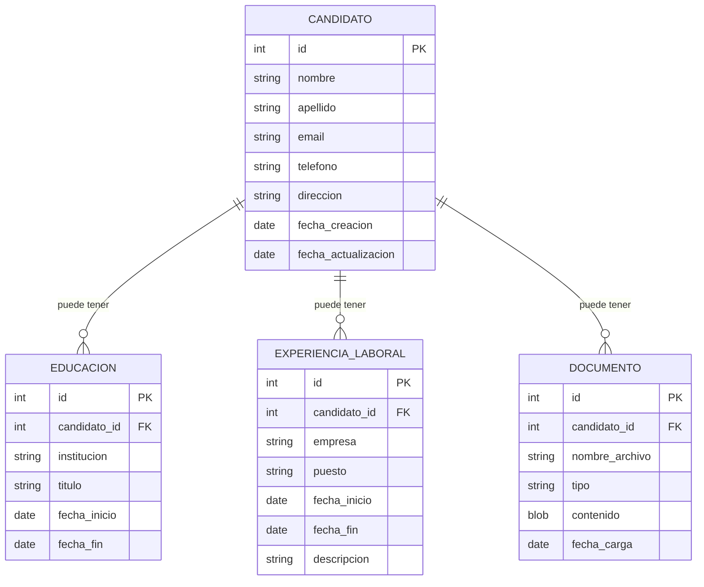

# Prompts Juan Manuel López Closa

## Prompts Fase 1) Refinar Historia de usuario
```
Como arquitecto técnico necesito que dada la siguiente historia de usuario desgranes las 3 tareas técnicas. 
Vamos a ir una a una, no pases a la siguiente hasta que te confirme que hemos refinado suficiente la anterior.

**Historia de usuario**:
----
**Añadir Candidato al Sistema (LTI-001)**:
**Como** reclutador,
**Quiero** tener la capacidad de añadir candidatos al sistema ATS,
**Para que** pueda gestionar sus datos y procesos de selección de manera eficiente.

**Criterios de Aceptación**:
1. **Accesibilidad de la función**: Debe haber un botón o enlace claramente visible para añadir un nuevo candidato desde la página principal del dashboard del reclutador.
2. **Formulario de ingreso de datos**: Al seleccionar la opción de añadir candidato, se debe presentar un formulario que incluya los campos necesarios para capturar la información del candidato como nombre, apellido, correo electrónico, teléfono, dirección, educación y experiencia laboral.
2. **Validación de datos**: El formulario debe validar los datos ingresados para asegurar que son completos y correctos. Por ejemplo, el correo electrónico debe tener un formato válido y los campos obligatorios no deben estar vacíos.
3. **Carga de documentos**: El reclutador debe tener la opción de cargar el CV del candidato en formato PDF o DOCX.
4. **Confirmación de añadido**: Una vez completado el formulario y enviada la información, debe aparecer un mensaje de confirmación indicando que el candidato ha sido añadido exitosamente al sistema.
5. **Errores y manejo de excepciones**: En caso de error (por ejemplo, fallo en la conexión con el servidor), el sistema debe mostrar un mensaje adecuado al usuario para informarle del problema.
6. **Accesibilidad y compatibilidad**: La funcionalidad debe ser accesible y compatible con diferentes dispositivos y navegadores web.

**Notas**:
- La interfaz debe ser intuitiva y fácil de usar para minimizar el tiempo de entrenamiento necesario para los nuevos reclutadores.
- Considerar la posibilidad de integrar funcionalidades de autocompletado para los campos de educación y experiencia laboral, basados en datos preexistentes en el sistema.

**Tareas Técnicas**:
- Asegurar la seguridad y privacidad de los datos del candidato.
- Desarrollar el backend necesario para procesar la información ingresada en el formulario.
- Implementar la interfaz de usuario para el formulario de añadir candidato.
----

El proyecto está formado por 2 módulos y una base de datos con las siguientes tecnologías:
- Frontend: Módulo en React con TypeScript
- Backend: Módulo en Node y Express con TypeScript, usando Jest para los test
- Base de datos: PostgreSQL dockerizada con un docker-compose.yml

Todas las tareas técnicas deben contener descripción detallada. Además deben dar las instrucciones para que se siga DDD, TDD y buenas prácticas para las tecnologías mencionadas.
Deben incluir los criterios de aceptación de la historia de usuario que apliquen a la tarea y pueden ampliarse para cumplir con los requisitos propios de la tarea.

La primera tarea será preparar el modelo de datos y la migración del esquema PostgreSQL. Se debe tener en cuenta Asegurar la seguridad y privacidad de los datos del candidato
```

### Refinamiento Tarea 1 (ChatGPT 3.5-turbo via CodeGPT)
```
De acuerdo, pero vamos a detallar el modelo de datos en un diagrama mermaid. Puedes incluirlo
```

```
Las relaciones deberían ser 0-N en vez de 1-N, para poder registrar primero el candidato y luego ir añadiendo lo que haga falta.
```

```
Hay alguna forma estándar de realizar la migración de datos en PostgreSQL en el entorno actual (Node, npm, ...)?
```

```
Puedes ampliar el ejemplo anterior? Por ejemplo, cómo se añadiria una columna "linkedin_url" al candidato?
```

```
De acuerdo, puedes modificar la Tarea 1 para incluir que se utilizará esta forma de realizar las migraciones? No importa incluir ejemplos ni nada. Solo indicar que se seguirá la forma estándar de trabajar con esta herramienta.
```

> Da bastantes problemas


### Refinamiento Tarea 2 (Claude 3.5 Sonnet via CodeGPT)
```
De acuerdo, podemos pasar a la segunda tarea en la que implementaremos en el módulo "backend" un API REST para añadir candidatos y su información.

Se debe describir en la tarea todos los detalles e indicar la importancia de seguir buenas prácticas como DDD y TDD. Se propondrá la estructura de paquetes. 

Se debe tener en cuenta el modelo de base de datos anterior.
```

> Es muy molesto que al copiar y pegar no mantenga el formato Markdown

```
Puedes añadir el detalle de la petición REST para añadir el candidato? Utiliza formato OpenAPI para documentar el endpoint.
```

```
El idioma para el código (endpoints, campos, variables, etc.) será en Inglés. Puedes adaptar tu respuesta?
```

> A partir de aquí me contesta en inglés todo, no solo el código.

### Refinamiento Tarea 3 (Claude 3.5 Sonnet via CodeGPT)
```
Perfecto. Pasemos a refinar la tarea 3: Implementar la interfaz de usuario para el formulario de añadir candidato.

Recordemos que debemos usar el módulo "frontend" que utiliza React JS. Se debe seguir las buenas prácticas para ReactJS usando TypeScript.

Se utilizará el endpoint definido antes /api/candidates. 

Se debe tener en cuenta los criterios de aceptación de la historia de usuario:

**Criterios de Aceptación**:

1. **Accesibilidad de la función**: Debe haber un botón o enlace claramente visible para añadir un nuevo candidato desde la página principal del dashboard del reclutador.

2. **Formulario de ingreso de datos**: Al seleccionar la opción de añadir candidato, se debe presentar un formulario que incluya los campos necesarios para capturar la información del candidato como nombre, apellido, correo electrónico, teléfono, dirección, educación y experiencia laboral.

2. **Validación de datos**: El formulario debe validar los datos ingresados para asegurar que son completos y correctos. Por ejemplo, el correo electrónico debe tener un formato válido y los campos obligatorios no deben estar vacíos.

3. **Carga de documentos**: El reclutador debe tener la opción de cargar el CV del candidato en formato PDF o DOCX.

4. **Confirmación de añadido**: Una vez completado el formulario y enviada la información, debe aparecer un mensaje de confirmación indicando que el candidato ha sido añadido exitosamente al sistema.

5. **Errores y manejo de excepciones**: En caso de error (por ejemplo, fallo en la conexión con el servidor), el sistema debe mostrar un mensaje adecuado al usuario para informarle del problema.

6. **Accesibilidad y compatibilidad**: La funcionalidad debe ser accesible y compatible con diferentes dispositivos y navegadores web.

También hay que tener en cuenta las notas de la historia de usuario:

- La interfaz debe ser intuitiva y fácil de usar para minimizar el tiempo de entrenamiento necesario para los nuevos reclutadores.
```

```
No debes implementar nada, solo realizar la descripción de la tarea. Puedes incluir los comentarios o mejoras que has comentado. Para los componentes utiliza Material UI
```


## Prompts Fase 2) Implementar Tarea 1: Modelo de datos

Vamos a implementar la primera tarea. Recordemos:

### Tarea Técnica 1: Diseño y Creación de la Base de Datos**

**Objetivo**: Diseñar y crear una base de datos PostgreSQL para almacenar información de candidatos, incluyendo sus datos personales, educación, experiencia laboral y documentos.

**Pasos**:
1. Diseñar el esquema de la base de datos con las siguientes tablas, siguiendo el esquema MER descrito en la siguiente sección:
    - Candidato
    - Educación
    - Experiencia Laboral
    - Documento
2. Utilizar node-pg-migrate como herramienta estándar para gestionar las migraciones de la base de datos. Esto incluirá:
    - Configuración inicial de node-pg-migrate en el proyecto.
    - Creación de archivos de migración para cada tabla y relación.
    - Implementación de las migraciones para crear las tablas y establecer las relaciones.
    - Asegurar que cada tabla tenga las columnas necesarias y que se establezcan las relaciones apropiadas entre ellas.
3. Implementar las migraciones utilizando los comandos estándar de node-pg-migrate.

**Entregable**: Archivos de migración de node-pg-migrate que, al ejecutarse, creen el esquema completo de la base de datos.

**Modelo de datos a representar:**


Puedes ir indicando paso a paso los ficheros a crear y su contenido?


> He tenido problemas al ejecutar la migración de la base de datos con `npx node-pg-migrate up`. 
> No he sido capaz de solucionarlo con CodeGPT. He cambiado a Cursor.sh para ver si me ayudaba más y tampoco.
> El problema estaba en que creé un fichero .env en la raíz, al lado de docker-compose.yml para poder ejecutar bien el entorno dockerizado con `docker compose up -d db` pero luego para la migración se estaba usando uno que ya existía en la carpeta backend.

> Tras corregir el .env de la carpeta backend, he podido ejecutar `npx node-pg-migrate up` sin problemas.

> Se ha utilizado el autocompletado de cursor.sh para documentar esta parte en el Readme.md


## Prompts Fase 3) Implementar Tarea 2: Tarea de backend (Usando IDE Cursor.sh)

### Antes de lanzar la tarea he corregido los test, que fallaban:
```
Como puedo corregir este warning cuando utilizo `npm test`?

Ran all test suites.
Jest did not exit one second after the test run has completed.

'This usually means that there are asynchronous operations that weren't stopped in your tests. Consider running Jest with `--detectOpenHandles` to troubleshoot this issue.
```


### Ahora sí, la tarea:

Vamos a implementar la segunda tarea. Recordemos:

### Tarea Técnica 2: Implementación del API REST para añadir candidatos

**Objetivo**: Desarrollar un API REST en el módulo backend para permitir la adición de candidatos y su información asociada al sistema ATS.

**Descripción**: Esta tarea implica la creación de endpoints REST para manejar la adición de candidatos, incluyendo su información personal, educación, experiencia laboral y documentos. Se seguirán los principios de Domain-Driven Design (DDD) y Test-Driven Development (TDD) para asegurar un diseño robusto y mantenible.

**Estructura de paquetes propuesta**:
```
src/
├── application/
│   └── AddCandidate.ts
├── domain/
│   ├── entities/
│   │   ├── Candidate.ts
│   │   ├── CandidateId.ts
│   │   ├── Education.ts
│   │   ├── WorkExperience.ts
│   │   └── Document.ts
│   ├── repositories/
│   │   └── ICandidateRepository.ts
├── infrastructure/
│   ├── database/
│   │   └── PostgresCandidateRepository.ts
│   └── http/
│       ├── controllers/
│       │   └── CandidateController.ts
│       └── routes/
│           └── candidateRoutes.ts
└── tests/
    ├── unit/
    │   └── application/
    │       └── AddCandidateUseCase.test.ts
    └── integration/
        └── api/
            └── addCandidate.test.ts
```

**Paso 1** 
1. **Implementar pruebas de integración**:
    * Escribir pruebas para el endpoint de añadir candidato en tests/integration/api/addCandidate.test.ts.
    * Esta prueba solo comprobará el código 201 pero ya pasará toda la información como se define en la especificación.
2. **Desarrollar controlador HTTP**:
    * Implementar CandidateController en infrastructure/http/controllers/ para manejar las solicitudes HTTP. En este primer punto devolverá 201
3. **Definir rutas API**:
    * Crear candidateRoutes.ts en infrastructure/http/routes/ para definir los endpoints del API.
4. Aquí probaremos que el endpoint funcione. No sigas hasta que compruebe.

**Paso 2**
1. **Implementar entidades del dominio**:
    * Crear las clases Candidate, Education, WorkExperience, y Document en el directorio domain/entities/.
    * Estas clases deben encapsular la lógica de negocio y las validaciones pertinentes.
2. **Implementar casos de uso**:
    * Crear AddCandidateUseCase en application para encapsular la lógica de añadir un candidato.
3. **Definir interfaces de repositorio**:
    * Crear ICandidateRepository en domain/repositories/ para definir los métodos de acceso a datos.
4. **Implementar pruebas unitarias**:
    * Escribir pruebas para AddCandidateUseCase en tests/unit/application/AddCandidateUseCase.test.ts.
5. **Modificar CandidateController para llamar a AddCandidateUseCase**
6. Aquí probaremos que el endpoint funcione. No sigas hasta que compruebe.

**Paso 3**
1. **Implementar repositorio concreto**:
  * Crear PostgresCandidateRepository en infrastructure/database/ que implemente ICandidateRepository.
2. Aquí probaremos que el endpoint funcione mirando en Base de datos.


**Criterios de Aceptación**:
- El API debe permitir añadir un candidato con toda su información asociada en una sola llamada.
- Debe validar los datos de entrada según los criterios especificados en la historia de usuario.
- Debe manejar errores y excepciones, retornando códigos de estado HTTP apropiados.
- Debe implementar autenticación y autorización para asegurar que solo los reclutadores puedan añadir candidatos.

**Consideraciones de DDD y TDD**:
- Seguir el principio de separación de concerns, manteniendo la lógica de negocio en el dominio.
- Utilizar Value Objects para encapsular conceptos del dominio como Email o PhoneNumber.
- Implementar pruebas unitarias antes de escribir el código de producción (TDD).
- Utilizar mocks y stubs para aislar las pruebas unitarias de dependencias externas.

**Especificación de la petición REST para añadir un candidato**

```yaml
openapi: 3.0.0
info:
  title: Candidate Management API
  version: 1.0.0
  description: API for adding candidates to the ATS system

paths:
  /api/candidates:
    post:
      summary: Add a new candidate
      description: Adds a new candidate with their personal information, education, work experience, and documents.
      tags:
        - Candidates
      security:
        - bearerAuth: []
      requestBody:
        required: true
        content:
          application/json:
            schema:
              $ref: '#/components/schemas/CandidateInput'
      responses:
        '201':
          description: Candidate added successfully
          content:
            application/json:
              schema:
                $ref: '#/components/schemas/CandidateResponse'
        '400':
          description: Invalid input data
          content:
            application/json:
              schema:
                $ref: '#/components/schemas/ErrorResponse'
        '401':
          description: Unauthorized
          content:
            application/json:
              schema:
                $ref: '#/components/schemas/ErrorResponse'
        '500':
          description: Internal server error
          content:
            application/json:
              schema:
                $ref: '#/components/schemas/ErrorResponse'

components:
  securitySchemes:
    bearerAuth:
      type: http
      scheme: bearer
      bearerFormat: JWT

  schemas:
    CandidateInput:
      type: object
      required:
        - candidate
      properties:
        candidate:
          $ref: '#/components/schemas/CandidateData'
        education:
          type: array
          items:
            $ref: '#/components/schemas/Education'
        workExperience:
          type: array
          items:
            $ref: '#/components/schemas/WorkExperience'
        documents:
          type: array
          items:
            $ref: '#/components/schemas/Document'

    CandidateData:
      type: object
      required:
        - firstName
        - lastName
        - email
      properties:
        firstName:
          type: string
        lastName:
          type: string
        email:
          type: string
          format: email
        phone:
          type: string
        address:
          type: string

    Education:
      type: object
      required:
        - institution
        - degree
        - startDate
      properties:
        institution:
          type: string
        degree:
          type: string
        startDate:
          type: string
          format: date
        endDate:
          type: string
          format: date

    WorkExperience:
      type: object
      required:
        - company
        - position
        - startDate
      properties:
        company:
          type: string
        position:
          type: string
        startDate:
          type: string
          format: date
        endDate:
          type: string
          format: date
        description:
          type: string

    Document:
      type: object
      required:
        - fileName
        - type
        - content
      properties:
        fileName:
          type: string
        type:
          type: string
        content:
          type: string
          format: byte

    CandidateResponse:
      type: object
      properties:
        id:
          type: string
        message:
          type: string
        candidate:
          $ref: '#/components/schemas/CandidateData'
        createdAt:
          type: string
          format: date-time
        updatedAt:
          type: string
          format: date-time

    ErrorResponse:
      type: object
      required:
        - code
        - message
      properties:
        message:
          type: string
          description: Error message
        error:
          type: string
          description: Error type or title
        details:
          type: array
          items:
            type: object
            properties:
              field:
                type: string
              message:
                type: string
          description: Additional error details, if applicable
```

Notas adicionales:
- La validación de datos debe realizarse tanto en el cliente como en el servidor.
- Los campos de fecha deben seguir el formato ISO 8601 (YYYY-MM-DD).
- Para los documentos, el contenido se envía como una cadena codificada en base64 para facilitar la transmisión de archivos binarios.
- La autenticación se realiza mediante un token JWT en el encabezado de Autorización.
- Los campos de fechaCreacion y fechaActualizacion son generados por el servidor y devueltos en la respuesta.
----

```
Necesito que addCAndidate.test.ts, cuando finalice el test (en el método afterAll) borre el candidato creado. Para ello debe hacerlo directamente contra la base de datos PostgreSQL.
```

> Si lanzaba este prompt desde dentro del fichero addCandidate.test.ts no lo hacía bien. Intentaba por 2 vaces hacerlo via DELETE /api/candidate que no existía y luego usando un módulo inventado de conexión a BBDD y diciendo que lo crease.
> Al hacerlo desde el Chat, si que ha hecho la sugerencia correcta.


Inline comment en addCandidate.test.ts:
```
// Check against database that candidate is created
```

> Al haber modificado la tarea para hacerla iterativa por pasos, se ha dejado toda la parte de Relaciones del candidato: WorkExperience, Education y Documents.

```
Puedes revisar con la descripción de la Tarea 2 y listar lo que falta por hacer?
```
> No ha encontrado nada nuevo por hacer.

```
Faltan los siguientes puntos por hacer de la tarea:
- Añadir el resto de información del candidato: Education (array), WorkExperience (array) y Documents (array)
- Añadir test de aceptación para datos inválidos de entrada
- Utilizar Value Objects para encapsular conceptos como Email, PhoneNumber
```

> Al lanzar el test para el segundo punto, el test falla porque espera un 400 pero recibe un 201. Se hace "Debug with AI"
> Identifica correctamente el problema y dic que yo debería implementar la validación de los datos en AddCandidateUseCase.test.ts

```
Puedes añadir las validaciones necesarias para los datos que se reciben en la clase @Candidate.ts ? teniendo en cuenta los Value Objects creados PhoneNumber y Email?
```

```
La clase ValidationError no existe. Hay algun estándar para este tipo de validaciones?
```

### Resolución de varios errores...
```
En el try-catch de @CandidateController.ts  puedes distinguir entre un error ValidationError o uno genérico? el primero devolverá un HTTP 400 y el segundo un HTTP 500
```
> Da un error "DatabaseError". Se investiga con 'Debug with AI' pero solo dice de tratarlo en un catch aparte.

```
Puedes crear un test de integración para la clase @PostgresCandidateRepository.ts ?
```
```
Please help me debug this code. Only debug the latest error.
```
```
You can find the definitions at @migrations  folder
```


## Prompts Fase 4) Implementar Tarea 3: Tarea de frontend

Vamos a implementar la Tarea: Implementar la interfaz de usuario para el formulario de añadir candidato. Debes tener en cuenta el endpoint creado en la Tarea 2.
----
**Tarea: Implementar la interfaz de usuario para el formulario de añadir candidato**

**Descripción**: Desarrollar una interfaz de usuario intuitiva y accesible para añadir nuevos candidatos al sistema ATS, utilizando React con TypeScript y Material UI. La interfaz debe cumplir con los criterios de aceptación especificados y seguir las mejores prácticas de desarrollo en React.

**Componentes principales a desarrollar:**
- **AddCandidateButton**
    - Un botón de Material UI claramente visible en el dashboard del reclutador.
    - Al hacer clic, debe abrir el formulario de añadir candidato.
- **AddCandidateForm**
    - Un formulario completo utilizando componentes de Material UI.
    - Debe incluir campos para toda la información del candidato: datos personales, educación, experiencia laboral y carga de documentos.
    - Implementar validación de campos utilizando una biblioteca como Yup junto con react-hook-form.
- **EducationForm**
    - Un subcomponente para manejar la información educativa del candidato.
    - Debe permitir añadir múltiples entradas de educación.
- **WorkExperienceForm**
    - Un subcomponente para manejar la experiencia laboral del candidato.
    - Debe permitir añadir múltiples entradas de experiencia laboral.
- **FileUpload**
    - Un componente para manejar la carga de documentos (CV en PDF o DOCX).
    - Utilizar el componente de carga de archivos de Material UI.

**Funcionalidades clave:**
- Validación de datos en tiempo real utilizando Yup y react-hook-form.
- Manejo de errores y visualización de mensajes de error claros.
- Implementación de un indicador de carga durante el envío del formulario.
- Mostrar un mensaje de confirmación al añadir exitosamente un candidato.
- Manejar errores de red o del servidor y mostrar mensajes apropiados al usuario.

**Consideraciones técnicas:**
- Utilizar hooks personalizados para la lógica de negocio, como useAddCandidate.
- Implementar la comunicación con el backend utilizando Axios o Fetch API.
- Utilizar TypeScript para definir interfaces claras para los datos del candidato y las props de los componentes.
- Seguir los principios de diseño de Material UI para mantener una apariencia coherente.

**Mejoras de accesibilidad y usabilidad:**
- Utilizar etiquetas semánticas de HTML5 para mejorar la accesibilidad.
- Implementar navegación por teclado para todos los elementos interactivos.
- Asegurar que todos los campos tengan etiquetas asociadas y descripciones para lectores de pantalla.
- Considerar la implementación de un formulario por pasos (stepper) para mejorar la experiencia del usuario en formularios largos.
- Utilizar colores con suficiente contraste y tamaños de fuente adecuados para mejorar la legibilidad.

**Pruebas:**
- Implementar pruebas unitarias para los componentes utilizando Jest y React Testing Library.
- Realizar pruebas de integración para asegurar el correcto funcionamiento del flujo completo de añadir un candidato.
- Probar la accesibilidad utilizando herramientas como axe-core.

**Documentación:**
- Proporcionar comentarios claros en el código para explicar la lógica compleja.
- Crear una documentación básica de los componentes, incluyendo sus props y funcionamiento.

**Consideraciones adicionales:**
- Asegurar que la interfaz sea responsiva y funcione correctamente en diferentes tamaños de pantalla.
- Optimizar el rendimiento, especialmente al manejar formularios grandes o cargas de archivos.
- Considerar la internacionalización para futuros requisitos de múltiples idiomas
----

> Empiezo a copiar los 4 componentes generados y hay errores en los import. Pulso en "AI Fix with Chat".

```
En la pantalla principal debería haber un enlace hacia otra donde encontremos el formulario. ¿Cómo puedo hacer eso?
```
```
Falla el import de 'react-router-dom'
```

### Intentar primero hacer otra pantalla

```
For the code present, we get this error:
Module '"react-router-dom"' has no exported member 'Switch'.

How can I resolve this? If you propose a fix, please make it concise.
```
```
Hay forma de poner una Route por defecto?
```

### Ahora empezamos a copiar los componentes propuestos en el primer prompt de la tarea.
```
Para qué sirve la librería Yup que me has propuesto en @AddCandidateForm.tsx?
```
```
Puedes añadir a @AddCandidateForm.tsx  todos los campos de un Candidato? Puedes verlos en @Candidate.ts 
```

> Se han resuelto varios imports

### Añadimos mas campos al formulario
```
Puedes revisar el formulario de @AddCandidateForm.tsx  para incluir todos los campos de las relaciones @WorkExperience.ts , @Document.ts  y @Education.ts ?
```


## Prompts Fase 5) Extras
- Considerar la posibilidad de integrar funcionalidades de autocompletado para los campos de educación y experiencia laboral, basados en datos preexistentes en el sistema.